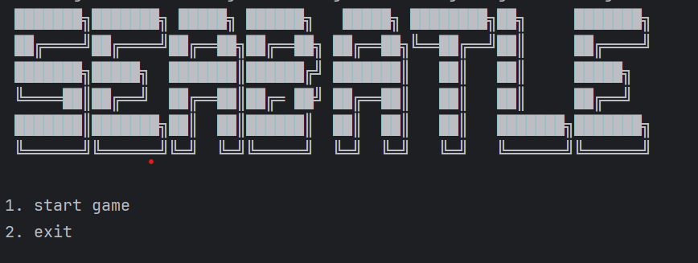
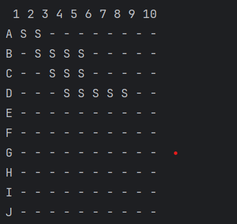
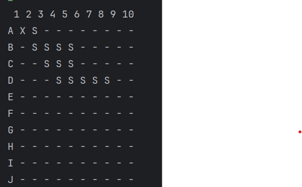
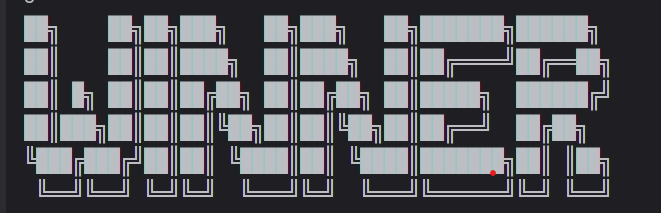
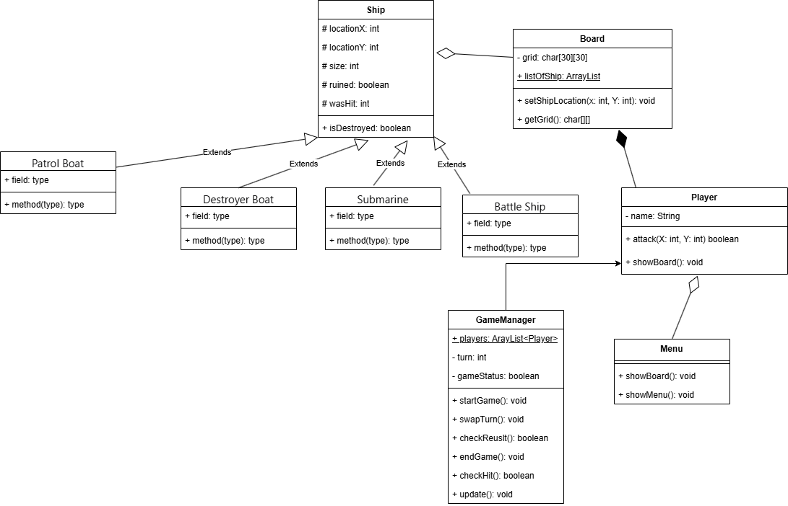
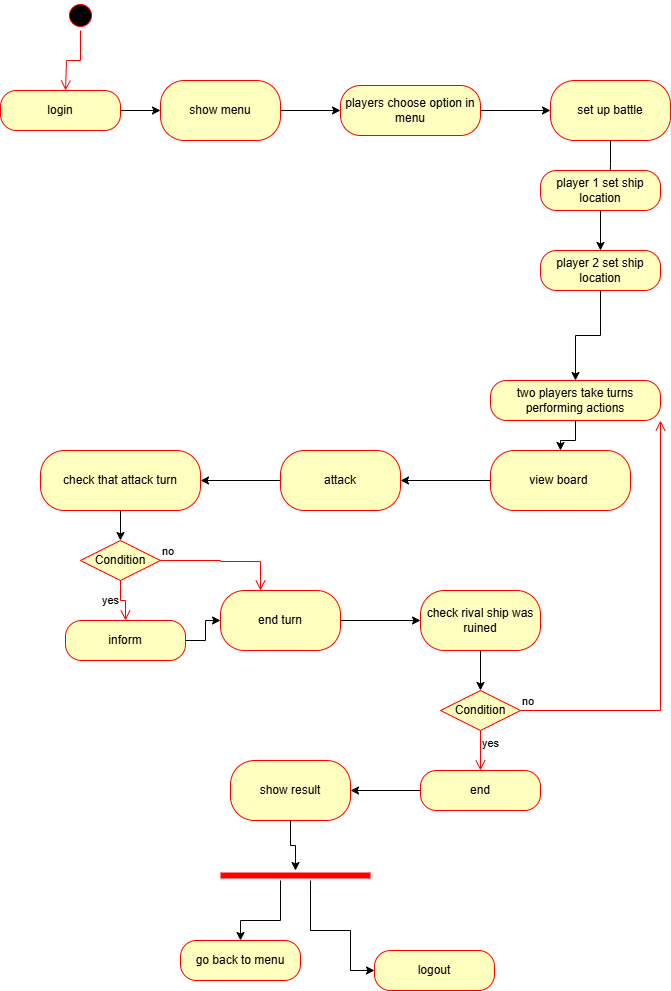

# seabattle:

Sea Battle is a two-player game. The game is played on four grids, two for each player. The grids are usually square-shaped—often 10 × 10—and individual cells within the grid are identified by letters and numbers. On one grid, players arrange their ships and record the opponent's shots. On the other grid, players record their own shots.
The project was done by [Nguyễn Hoàng Biên](https://github.com/bien3008), 

in the course of Object Oriented Programming at [ProPTIT](https://proptit.com/).

## Tech Stack

- [Java](https://www.java.com/en/)

## Installation

- Clone the repo
- Open the project in your IDE
- Run the project

Gameplay video: (https://www.youtube.com/watch?v=FsP57rVUacU&ab_channel=Bi%C3%AAnNguy%E1%BB%85nHo%C3%A0ng)
# Game images:






## Usage

- Project Structure

```bash

├── src
│   ├── main
│   │   ├── java
│   │   │   ├── data
│   │   │   │   ├── Ship.java
│   │   │   ├── login
│   │   │   │   ├── Login.java
│   │   │   │   ├── Menu.java
│   │   │   ├── main
│   │   │   │   ├── Main.java
│   │   │   │   └── Scan.java
│   │   │   ├── manager
│   │   │   │   ├── GameBoard.java
│   │   │   │   ├── PlayerManager.java
│   │   │   │   ├── SystemManager.java
│   │   │   ├── user 
│   │   │   │   ├── Player.java

```
# UML



## Contributing

Pull requests are welcome. For major changes, please open an issue first
to discuss what you would like to change.

Please make sure to update tests as appropriate.

## License

[MIT](https://choosealicense.com/licenses/mit/)